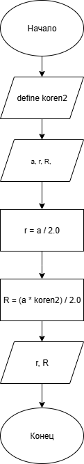
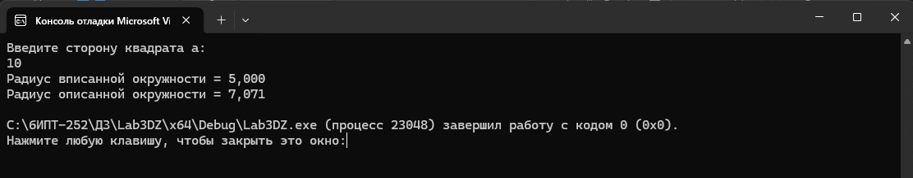

# Домашнее задание к работе 3
## Условия задачи
Написать и отладить программу расчета радиуса описанной и вписанной окружности для квадрата со стороной a (вещественное значение a задает пользователь)

## 1. Алгоритм и блок-схема

### Алгоритм
1. **Начало**
2. Объявить константы:
- `koren2` (float) — √2
3. Инициализировать переменные:
- `a` (float) — сторона квадрата.
- `r` (float), `R`(float) — радиус вписанной и описанной окружности.
- `koren2` (float) — √2
3. Вычислить по формуле радиус вписанной окружности:
- `r` = `a` / 2.0
4. Вычислить по формуле радиус описанной окружности:
- `R` = (`a` * `koren2`) / 2.0
5. Вывести результаты расчётов:
- Радиус вписанной окружности = `r`
- Радиус описанной окружности = `R`
6. **Конец**
  
### Блок-схема

https://github.com/Senya-Sidorov/Lab3/blob/main/lab3diagram_1.png

## 2. Реализация программы

#define _CRT_SECURE_NO_DEPRECATE
#include <stdio.h>
#include <locale.h>
#define koren2 1.4142
int main()
{
	setlocale(LC_ALL, "RUS");

	float a;
	float r, R;

	puts("Введите сторону квадрата a: ");

	scanf("%f", &a);

	r = a / 2.0;
	R = (a * koren2) / 2.0;

	printf("Радиус вписанной окружности = %.3f\n", r);
	printf("Радиус описанной окружности = %.3f\n", R);

	return 0;
}

## 3. Результаты работы программы

## 4. Информация о разработчике
Выполнил Сидоров Арсений, бИПТ-252

